# NCLDV Recover



## 一、NCLDV Recover 方法

需要软件

- [viralrecall](https://github.com/faylward/viralrecall)
- [metabat2](https://bitbucket.org/berkeleylab/metabat/src/master/)
- hmmer(conda install hmmer -c bioconda)
- prodigal(conda install prodigal -c bioconda)

设置环境变量

```bash
PROJECT=$PWD/test
SCRIPTS=$PWD/scripts
```

### 1、分箱

使用metabat2对组装的final.contigs.fa进行分箱

```bash
mkdir ${PROJECT}/00_bins
metabat2 -i ${PROJECT}/final.contigs.fa -a ${PROJECT}/depth.txt -o ${PROJECT}/00_bins/bin -s 100000 -t 4 -m 10000
```

### 2、基于marker hmm进行快速筛选

快速用maker.hmm来对分箱文件进行快速检查

```bash
# 需要先cd到viralrecall所在文件夹
python viralrecall.py -i ${PROJECT}/00_bins -p ${PROJECT}/01_markerhit -b -c -t 4 -db "marker"
```

使用viralrecall_summary.py汇总信息，得到summary.tsv文件；

```bash
python ${SCRIPTS}/viralrecall_summary.py -i ${PROJECT}/01_markerhit 
```

再使用viralrecall_marker_filter.py,根据平均分cutoff值（设置为1）和markhit数目>=3或包含mcp基因,进行快速筛选bin,得到marker_filtered_bin.tsv,对于test数据中，tsv中你可以得到四个通过筛选的bin。

```bash
python ${SCRIPTS}/viralrecall_marker_filter.py -i  ${PROJECT}/01_markerhit
```

### 3、使用viralrecall的完整模型进行打分

根据marker_filtered_bin.tsv得到筛选过的02_markerfiltered文件夹

```bash
CSV=${PROJECT}/01_markerhit/marker_filtered_bin.tsv

mkdir ${PROJECT}/02_markerfiltered
tail -n+2 ${CSV} | cut -f 1 | while read ID;do \
ln -s ${PROJECT}/00_bins/${ID}.fa ${PROJECT}/02_markerfiltered/${ID}.fa
done
```

对02_markerfiltered运行完整的viralrecall打分模型

```bash
python viralrecall.py -i ${PROJECT}/02_markerfiltered -p ${PROJECT}/03_score -b -c -f -t 10
```

使用pdfmerge.py可以把viralrecall生成的pdf合并为一个，方便查看结果

```bash
python ${SCRIPTS}/pdfmerge.py -i${PROJECT}/03_score/ -o "merged.pdf" -b False
```


### 4、质检

质检之前需要先把分箱的fa文件移动到03_score文件夹，方便筛选

```bash
BIN_INPUT=${PROJECT}/00_bins
tail -n+2 ${CSV} | cut -f 1  | while read bin_id;do
    ln -s ${BIN_INPUT}/${bin_id}.fa  ${PROJECT}/03_score/${bin_id}/${bin_id}.fa 
done
```

进行质检， 质检标准

* 剔除污染的contig：只保留score > 0 & num_viralhits >3 & contig_length > 5000 过滤 bin.fa 文件中的contig
* 剔除污染contig后，只保留总大小超过 100 kb & mean score >1 & marker gene hit有3个及以上或要有mcp基因的bin

```bash
python ${SCRIPTS}/viralrecall_qc.py -i ${PROJECT}/03_score -o ${PROJECT}/04_qc
```

## 二、进一步分析

TBD

## 三、参考资料

- Moniruzzaman, M., Martinez-Gutierrez, C.A., Weinheimer, A.R. et al. Dynamic genome evolution and complex virocell metabolism of globally-distributed giant viruses. Nat Commun 11, 1710 (2020). https://doi.org/10.1038/s41467-020-15507-2
- [giant_virus_MAG_SOP.md](https://github.com/faylward/bioinformatics_tutorials/blob/master/giant_virus_MAG_SOP/giant_virus_MAG_SOP.md)
