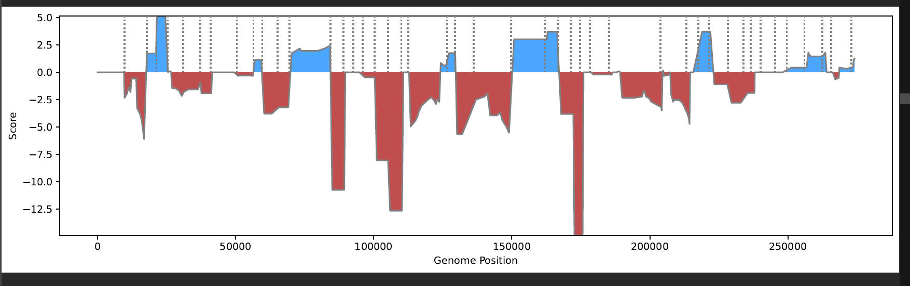
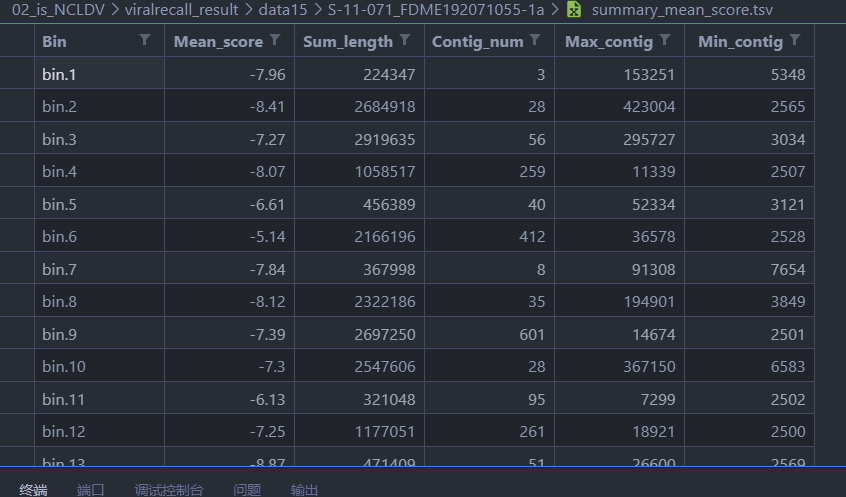

# 【生信项目】 反刍动物消化道挖掘NCLDV病毒，我的第二个毕设题目又前功尽弃了！

> 视频地址：https://www.bilibili.com/video/BV1mZ4y1R7fp?spm_id_from=333.999.0.0

hello，大家好，我是阿巛/Tron，这个视频呢，我会复盘下我失败的第二个毕设题目。我将从四个部分来介绍，依次是项目背景介绍、挖掘方法、结论与改进以及最后的总结反思，那我们就开始吧。

## 1 项目背景介绍

第一部分是项目背景介绍。

先介绍下什么是 NCLDV 病毒，NCLDV 是核质大 DNA 病毒的简称，是 Nucleocytoviricota 门的 dsDNA 病毒（nucleocytoplasmic 核质的意思：既可以在宿主的细胞核也可以在细胞质中复制）。由于该类病毒体型、基因组规模大于普通病毒，所以被称之为巨病毒（giant virus）。

我这个项目的内容就是对反刍动物消化道的宏基因组数据进行 NCLDV 数据挖掘。

### 1.1 NCLDV 的特点

* **尺寸大、基因组大**：拥有已知的最大和最复杂的病毒基因组。基因组可以达到几个兆碱基大小，病毒体甚至比小细胞生物体尺寸类似甚至更大。
* **感染真核生物**：噬菌体感染的是细菌，而 NCLDV 能够广泛地感染从原生生物到动物等一系列真核生物。2018 年爆发的非洲猪瘟病毒就属于 NCLDV。不过目前没发现其能对人类健康造成影响。
* **NCLDV 基因组编码显著多样的功能**：包括许多仅在细胞谱系中发现的基因，这点就比较奇怪，因为通常具有较小基因组的病毒并不包含这些过程的基因，只需要借用细胞的代谢过程就可以了。
* **基因多样性**：来自不同家族的 NCLDV 之间的平均氨基酸同源性可低至约 20%。所以想要从宏基因组中挖掘 NCLDV 病毒就存在一定的难度

### 1.2 目前研究进展

* **宏基因组促进 NCLDV 谱系发现**：过去关于巨病毒的了解还仅限于与原生生物和藻类共生的病毒分离株。最近几年，宏基因组学和单细胞基因组学研究促进了新 NCLDV 成员的发现；
* 该类病毒**广泛存在于环境中**：大型的宏基因组分析表明，NCLDV 通常在宏基因组数据集中大量存在，该类病毒实际广泛分布于环境中，在水生系统中尤其多样和丰富；
* 该类病毒**通过水平基因转移促进宿主基因组进化**：对真核生物基因组的分析表明，内源性 NCLDV 衍生序列在某些谱系中很常见，NCLDV 可能在宿主基因组进化中起着重要作用；
* 目前对 NCLDV 的宏基因组挖掘分析主要是取样于环境样本，我自己还没看到对动物消化道宏基因组挖掘出 NCLDV 的文章，所以就看看我能不能挖掘出来吧。

## 2 挖掘方法

第二部分介绍下 NCLDV 病毒的挖掘方法

首先要知道 NCLDV 病毒比常规病毒都大，一般大小在 100kb 到 2Mb，通过宏基因组组装的 contig 不大可能就得到一个完整病毒，contig 都是需要先分箱再确定这个 bin 是不是 NCLDV 的。因为看参考论文 2 的影响，在挖掘 NCLDV 病毒的时候我就想从两个方向来筛选，基于 contig 水平和基于 bin 水平进行筛选。基于 contig 水平就是先筛选全部可能是 NCLDV 的 contig，把这些 contig 提取出来再分箱，然后再进行质检；而基于 bin 水平筛选就是直接对宏基因组数据进行分箱，然后对这些 bin 再进行筛选、质检。

### 基于 contig 水平筛选

先讲基于 contig 水平筛选这个方面，我找到了 virsorter2 这个软件，virsorter 听说是宏病毒组最常用的软件之一，virsorter2 则增加了许多病毒的分类，它的代码是对一个 fasta 序列的每个 contig 进行打分筛选，会把认为是病毒的 contig 单独抽出一个文件。我的 virsorter2 运行参数是这个

```bash
--include-groups NCLDV \
--min-length 5000  \
--min-score 0.5 \
-j 10 all
```

后续处理呢我会统计下病毒 contig 的得率，然后进行单样本分箱，再用 viralrecall 进行打分。viralrecall 是基于 bin 水平给 NCLDV 打分的软件，后面基于 bin 水平我会再提到。现在只要知道得分大于 0 说明越可能是病毒，小于 0 呢就越可能是其他物种。

一开始 virsorter2 能筛选出 NCLDV contig 时我还非常开心来着，结果呢，把这些 contig 拿去分箱，然后再用 viralrecall 的脚本打分，那结果谁能想到，惨不忍睹！！！！筛选和没筛选差不多……



我后来猛然想起 virsorter2 示例数据中是有 NCLDV 序列数据的，但是呢，那是一整个完整的病毒序列，不是 contig，是完整的！所以试图用 virsorter2 筛选 contig 这条路基本是死了，其实可以再尝试下直接用 hmmsearch 基于 NCVOG 来筛选 contig 的，但鉴于后面基于 bin 水平筛选也死了就没去尝试。

另外再说下 virsorter2 运行非常非常慢，一个样本要 13 小时......

### 基于 bin 水平筛选

接下来讲基于 bin 水平进行筛选，我在 Github 上找到了 Viralrecall 这个 python 写的软件，这个软件的功能就是完全为鉴定 NCLDV 服务的，关于这个软件鉴定 NCLDV 的性能我进行过测试，对 200 个病毒 MAG 进行打分，平均分都大于 1，明显是没有问题的。软件的运行结果主要是会给每个分箱得到一个 summray.tsv 文件和可视的整体得分 pdf 文件（就是前面那张打分图）。我的运行参数是 `-b -c -f`，-c 参数是为了对每个 contig 打分，这样就可以后期去除可能是污染的 contig；-f 参数为了得到整体的打分图，-b 参数为对整个文件夹下的 fasta 文件批量运行。为了整合和统计信息呢，我还写了几个补充脚本。

* **统计脚本**：汇总平均分、分箱总长度、contig 数目、最大 contig 长度、最小 contig 长度、markerhit 数目等信息到表格里。这样可以一目了然的知道分箱得分的信息

  * 
  * ```python
    #!/usr/bin/env python3

    """help
    input：work_dir绝对路径
    脚本： /mnt/raid7/Dachuang/Achuan/scripts/viralrecall_filter.py
    功能：
    viralrecall基于MAG水平筛选NCLDV，
    1. 先统计每个bin的平均得分，
    2. 根据cutoff值（暂定为1），大于cutoff的bin会在infer_NCLDV.tsv中;如果没有大于cutoff的bin，则没有infer_NCLDV.tsv这个文件
    """
    """usage
    # 一个文件夹

    python /mnt/raid7/Dachuang/Achuan/scripts/viralrecall_filter.py --i /mnt/raid7/Dachuang/Achuan/02_is_NCLDV/viralrecall/bins_out --b /mnt/raid7/Dachuang/Achuan/02_is_NCLDV/viralrecall/bins

    ## 多个文件夹
    PROJECT=/mnt/raid7/Dachuang/Achuan/02_is_NCLDV/viralrecall_result
    DATA=data15
    ls ${PROJECT}/${DATA} |while read id;do python viralrecall_filter.py --i ${PROJECT}/${DATA}/${ID} --b /mnt/raid7/wuyingjian/buffalo/05_binning/${DATA}/${ID}/final.contigs.fa.metabat-bins10;done
    """

    # 0. 读取参数
    # 创建一个ArgumentParser对象，以存储实参信息
    import os
    import pandas as pd
    import argparse
    description = """
    功能：
    viralrecall基于MAG水平筛选NCLDV，
    1. 先统计每个bin的平均得分，contig数目，总长度，最大contig长度，最小contig长度
    2. 根据cutoff值（暂定为1），大于cutoff的bin会在infer_NCLDV.tsv中;如果没有大于cutoff的bin，则没有infer_NCLDV.tsv这个文件
    """
    parser = argparse.ArgumentParser(description=description)
    # 方法add_argument()添加要解析的命令内容
    parser.add_argument(
        '--i', type=str, help="input_dir: viralrecall result", required=True)
    args = parser.parse_args()  # 读入输入的参数，生成一个列表args
    work_dir = args.i  # 接着对参数的任何操作，调用命名为xxx的参数方式为args.xxx


    scores = []
    bins = []
    sum_lengths = []
    contig_nums = []
    max_contigs = []
    min_contigs = []
    # 1. 先统计每个bin的平均得分
    for parent, dirnames, filenames in os.walk(work_dir):
        for dir in dirnames:
            table = pd.read_table(f"{work_dir}/{dir}/{dir}.summary.tsv")
            mean_score = table["score"].mean()
            sum_length = table["contig_length"].sum()
            contig_num = table.shape[0]
            max_contig = table["contig_length"].max()
            min_contig = table["contig_length"].min()
            scores.append(mean_score)
            sum_lengths.append(sum_length)
            contig_nums.append(contig_num)
            max_contigs.append(max_contig)
            min_contigs.append(min_contig)
            bins.append(dir)
    summary_score = pd.DataFrame(
        {"bin": bins, "mean_score": scores, "sum_length": sum_lengths, "contig_num": contig_nums, "max_contig": max_contigs, "min_contig": min_contigs})
    summary_score.to_csv(work_dir+"/summary_mean_score.tsv", sep="\t", index=False)

    # 2. 根据cutoff值（暂定为1)进行筛选
    cutoff = 1  # 可能会改为10？ 现在有点纠结要不要用-c命令，-c就是对每个contig都进行打分，有利于筛选嵌入到NCLDV中的
    flag = sum(summary_score["mean_score"] > cutoff)


    # 3. 大于cutoff的bin.fa会移动到viralrecall result下
    if flag:
        infer_NCDLV = summary_score[summary_score["mean_score"] > 1]
        infer_NCDLV.to_csv(work_dir+"/infer_NCLDV.tsv", sep="\t", index=False)

    ```
* 筛选脚本：把一个分箱的平均分 cuttoff 设置为 1，筛选可能是 NCLDV 的 bin，即一个 bin 平均分只要大于 1，我就认为它是 NCLDV，这些 bin 的信息单独整理为表格。
* **统计数据集得率脚本**：这个是 bash 脚本，单独统计每个数据集每个样本中有多少分箱被认为是 NCLDV。

  * ```bash
    #!/bin/bash
    ######usage####
    # bash /mnt/raid7/Dachuang/Achuan/scripts/viralrecall_summary.sh $DATA
    ###########
    DATA=$1
    PROJECT=/mnt/raid7/Dachuang/Achuan/02_is_NCLDV/viralrecall_result

    cd ${PROJECT}/
    ls /mnt/raid7/wuyingjian/buffalo/05_binning/${DATA} > ${DATA}_id.txt


    #查询data数据集每个样本有多少分箱
    > ${DATA}_all_num.txt
    cat ${DATA}_id.txt | while read ID;do
    ls /mnt/raid7/wuyingjian/buffalo/05_binning/${DATA}/${ID}/final.contigs.fa.metabat-bins10| wc -l >> ${DATA}_all_num.txt;done

    # 查询每个样本有多少NCLDV
    > ${DATA}_NCLDV_num.txt
    > ${DATA}_NCLDV_bin.txt
    cat ${DATA}_id.txt | while read ID;do
        CSV=${DATA}/${ID}/infer_NCLDV.tsv
        if [ -f ${CSV} ] 
        then
            tail -n+2 ${CSV} | wc -l >> ${DATA}_NCLDV_num.txt
            tail -n+2 ${CSV} | cut -f 1| tr '\n' ', ' | sed 's/,$//' >> ${DATA}_NCLDV_bin.txt

        else
        echo 0 >> ${DATA}_NCLDV_num.txt
        echo " " >> ${DATA}_NCLDV_bin.txt

        fi 
    done


    paste ${DATA}_id.txt ${DATA}_all_num.txt ${DATA}_NCLDV_num.txt ${DATA}_NCLDV_bin.txt >  ${DATA}_summary.tsv

    #在第一行添加列信息
    sed -i '1i\ID\tAll_Bin_Num\tInfer_NCLDV_num\t\Infer_NCLDV' ${DATA}_summary.tsv

    rm ${DATA}_all_num.txt ${DATA}_NCLDV_num.txt ${DATA}_id.txt ${DATA}_NCLDV_bin.txt
    ```
* **合并 pdf 脚本**：viralrecall 可以给每个 bin 生成沿着长度的打分图，于是写了个脚本，可以合并一个样本所有分箱的打分 pdf 以方便快速预览每个样本所有分箱的得分情况。

  * ```python
    #!/usr/bin/env python3
    # -*- coding: utf-8 -*-
    '''
    本脚本用来合并viralrecall预测得分的pdf文件，输出的pdf文件按输入的pdf文件名生成书签
    对于单个样本，使用示例如下：
    python /mnt/raid7/Dachuang/Achuan/scripts/pdfmerge.py -i "/mnt/raid7/Dachuang/Achuan/02_is_NCLDV/viralrecall/bins_out" -o "merged.pdf" -b False

    示例说明：
    要合并的pdf文件所在的路径： /mnt/raid7/Dachuang/Achuan/02_is_NCLDV/viralrecall/bins_out
    合并后的pdf文件的输出文件名：merged.pdf
    是否从pdf文件中导入书签的值：False

    对于数据集下的所有样本
    PROJECT=/mnt/raid7/Dachuang/Achuan/02_is_NCLDV/viralrecall_result
    DATA=data15
    ls ${PROJECT}/${DATA} |while read id;do python3 /mnt/raid7/Dachuang/Achuan/scripts/pdfmerge.py --i ${PROJECT}/${DATA}/${ID}  -o "merged.pdf";done

    '''
    import os
    import sys
    import codecs
    from argparse import ArgumentParser, RawTextHelpFormatter
    from PyPDF2 import PdfFileReader, PdfFileWriter, PdfFileMerger

    def getfilenames(filepath='', filelist_out=[], file_ext='.pdf'):
        # 遍历filepath下的所有文件，包括子目录下的文件, 获取pdf
        for fpath, dirs, fs in os.walk(filepath):
            for f in fs:
                fi_d = os.path.join(fpath, f)
                if os.path.splitext(fi_d)[1] == file_ext:
                    filelist_out.append(fi_d)
                else:
                    pass
        return filelist_out

    def mergefiles(path, output_filename, import_bookmarks=False):
        # 遍历目录下的所有pdf将其合并输出到一个pdf文件中，输出的pdf文件默认带书签，书签名为之前的文件名
        # 默认情况下原始文件的书签不会导入，使用import_bookmarks=True可以将原文件所带的书签也导入到输出的pdf文件中
        merger = PdfFileMerger()
        filelist = getfilenames(filepath=path, file_ext='.pdf')
        out_filename = os.path.join(os.path.abspath(path), output_filename)
        if len(filelist) == 0:
            print("当前目录及子目录下不存在pdf文件")
            sys.exit()
        for filename in filelist:
            if filename == out_filename:
                print("已存在合并的pdf，将覆盖原来文件")
                continue
            f = codecs.open(filename, 'rb')
            file_rd = PdfFileReader(f)
            short_filename = os.path.basename(os.path.splitext(filename)[0])
            if file_rd.isEncrypted == True:
                print('不支持的加密文件：%s' % (filename))
                continue
            merger.append(file_rd, bookmark=short_filename,
                            import_bookmarks=import_bookmarks)
            print('合并文件：%s' % (filename))
            f.close()
        merger.write(out_filename)
        print('合并后的输出文件：%s' % (out_filename))
        merger.close()

    if __name__ == "__main__":
        description = """
        本脚本用来合并viralrecall预测得分的pdf文件，输出的pdf文件按输入的pdf文件名生成书签
        对于单个样本，使用示例如下：
        python /mnt/raid7/Dachuang/Achuan/scripts/pdfmerge.py -i "/mnt/raid7/Dachuang/Achuan/02_is_NCLDV/viralrecall/bins_out" -o "merged.pdf" -b False

        示例说明：
        要合并的pdf文件所在的路径： /mnt/raid7/Dachuang/Achuan/02_is_NCLDV/viralrecall/bins_out
        合并后的pdf文件的输出文件名：merged.pdf
        是否从pdf文件中导入书签的值：False

        对于数据集下的所有样本
        PROJECT=/mnt/raid7/Dachuang/Achuan/02_is_NCLDV/viralrecall_result
        DATA=data15
        ls ${PROJECT}/${DATA} |while read id;do python3 /mnt/raid7/Dachuang/Achuan/scripts/pdfmerge.py --i ${PROJECT}/${DATA}/${ID}  -o "merged.pdf";done
        """

        # 添加程序帮助，程序帮助支持换行符号
        parser = ArgumentParser(description=description,
                                formatter_class=RawTextHelpFormatter)

        # 添加命令行选项

        parser.add_argument("-i", "--input",
                            dest="input_path",
                            default=".",
                            help="PDF文件所在目录")
        parser.add_argument("-o", "--output",
                            dest="output_filename",
                            default="merged.pdf",
                            help="合并PDF的输出文件名",
                            metavar="FILE")
        parser.add_argument("-b", "--bookmark",
                            dest="import_bookmarks",
                            default="False",
                            help="是否从pdf文件中导入书签，值可以是'True'或者'False'")

        args = parser.parse_args()
        try:
            mergefiles(args.input_path, args.output_filename,
                    args.import_bookmarks)
        except:
            print('Error to merge pdf file:')
            print(sys.exc_info()[0],sys.exc_info()[1])

    ```
* **质检脚本**：运行完得率脚本后，我发现直接找平均分高于 1 的分箱都找不到，如果要解释的话，就有两种可能了。一种情况呢是数据集就没有 NCLDV，另一种情况呢，是数据分箱质量不大行，可能混有很多非 NCLDV 的 contig，造成数据污染，就导致分数变低了，毕竟我算的是平均分嘛。针对后者呢，我又写了一个质检脚本，这个脚本会剔除污染的 contig 和不符合标准的 bin，质检标准如下：

  * 剔除污染的 contig：只保留 fasta 文件中 score > 0 & num_viralhits >3 & contig_length > 5kb  的 contig
  * 剔除污染 contig 后，只保留总大小超过 100 kb ＆ mean score >1 以及 marker  hit 有 4 个及以上或要有 mcp 基因的 bin

来看下我的结果，我分析了 4 个数据集，114 个样本，5363 个分箱都没有一个分箱可以通过质检，这些数据都是水牛消化道的数据，其中有 98 个样本都是按理来说微生物非常丰富的瘤胃宏基因组数据。我不得不感叹一声，哎，这就是命啊！

* data13 ：共 16 个样本，共 577 个分箱，0 个 bin 通过初步质检 ❌
* data14： 共 62 个样本，共 1591 个分箱，0 个 bin 通过初步质检 ❌
* data15：共 18 个样本，1482 个分箱，，0 个 bin 通过初步质检 ❌
* data16：共 18 个样本，1713 个分箱，0 个 bin 通过初步质检 ❌

## 3 结论和改进

那结论就是反刍动物的消化道确实没有或只有很少的 NCLDV 吧。

一些数据集不需要质检就可以得到大于 1 分的 bin：对于作者给的 SOP 示例数据，我分箱得到 17 个 bin，通过筛选得到四个大于 1 分的 bin 的，通过看 viralrecall GitHub issue 也知道有人也是可以通过直接计算平均分筛选分箱得到结果的，也就是说如果这个数据集真的有 NCLDV，而且数据集质量还行，推测不用质检也可以得到大于 1 分的 bin。

后面我在咨询 viralrecall 作者的时候，也得到了如下回复，他的大体意思也是说没怎么在动物肠道宏基因组中发现 NCLDV

> I wouldn't be surprised if there are no NCLDV bins in an animal gut metagenome- I've surveyed quite a few gut metagenomes and they typically don't have many NCLDV (most of the viruses I pick up are Caudovirales). You could manually check a few borderline cases just to be sure, but unless you have another reason to think that NCLDV should be present then there may not be any.
>

我在重新复盘的时候，顺道也改进下基于 bin 水平挖掘 NCLDV 的流程。主要的改进点是

**使用 marker hmm 进行快速筛选**：其实我前面算是暴力用 viralrecall 的完整 hmm 模型来对所有数据进行打分，这样的好处就是可以直接得到得分表，坏处呢，就是运行太慢了，一个分箱大概要 20 分钟，一个样本有 60 个分箱的话就要 20h，我 data14、data15、data16 的样本加起来有 98 个呢，实在太慢……前面是为了偷懒，懒得自己写脚本，就直接跑全部模型的了，虽然已经知道数据集没有 NCLDV，但还是希望完善下流程，用 marker hmm 模型来判断有无 hit，快速筛选分箱。其实这才是正确的做法，毕竟如果 marker hit 不符合条件，基本可以确定这个数据就是没有 NCLDV 了。

我总结的从宏基因组中挖掘 NCLDV 大体流程是，对宏基因组数据进行组装、分箱，先用 viralrecall 的-db "marker"，基于 marker hit 快速筛选分箱，然后再对通过筛选的分箱进行完整打分，再通过质检（剔除污染的 contig 和不符合标准的 bin）最终得到的就是可能的 NCLDV MAG 了


```bash
组装的宏基因组数据->Metabat2分箱->运行viralrecall(marker hmm)-> 筛选->运行viralrecall（完整hmm)->质检->统计->NCLDV MAG
# 项目文件夹
00_bin 01_markerhit 02_markerfiltered 03_score 04_qc 
```

## 4 总结反思

好了，我的第二个毕设题目总结就到这里了，最后总结反思下自己通过这个项目学到的东西

1. 第一点是读文献要抓住重点，看论文不要傻傻地从头读到尾，一个自己不了解也目前用不到的分析方法先记录，重要的是你要概括出这篇文章主要的内容和方法，你有哪些启发和收获，哪些方法是你能借鉴的，千万不要傻傻地从头读到尾！
2. 第二点，要有自己的独立思考能力，我这个题目其实是毕设导师硬塞给我的，给我的时候我就怀疑反刍动物的消化道到底有没有这个病毒，读论文的时候也发现目前 NCLDV 的发现主要是在环境样本，但是我没有尝试和老师讨论这个问题，而是就那么傻傻地去想尽方法去挖掘病毒了，如果学聪明点，可能早就和老师说要换题目了。
3. 第三点还有就是要多利用身边资源，敢于且善于和老师、师兄姐讨论自己的想法。别自己瞎折腾，浪费时间，耗尽热情，也没做出什么东西，要学会站在前人的肩膀上做事
4. 第四点是要敢于自己写脚本，学会用代码去创造自己的的东西，不要一遇到需要在自己动脑筋写代码的部分，就内心打了退堂鼓了，千万不要畏难。写脚本前一定要先理清楚流程、步骤，然后一步步去实现它，就没有那么难啦。

## 5 参考文献

* Schulz, F., Alteio, L., Goudeau, D. et al. Hidden diversity of soil giant viruses. Nat Commun 9, 4881 (2018). https://doi.org/10.1038/s41467-018-07335-2
* Schulz, F., Roux, S., Paez-Espino, D. et al. Giant virus diversity and host interactions through global metagenomics. Nature 578, 432–436 (2020). https://doi.org/10.1038/s41586-020-1957-x
* Moniruzzaman, M., Martinez-Gutierrez, C.A., Weinheimer, A.R. et al. Dynamic genome evolution and complex virocell metabolism of globally-distributed giant viruses. Nat Commun 11, 1710 (2020). https://doi.org/10.1038/s41467-020-15507-2

